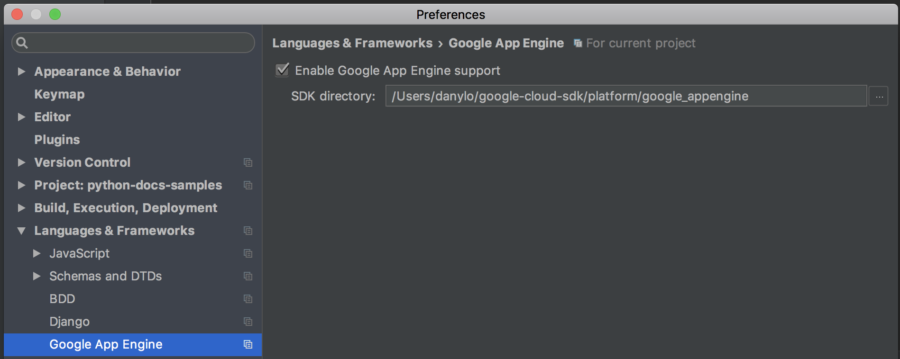

# gcloud

## Installation

Download and install SDK https://cloud.google.com/sdk/docs/

After unpucking run following from instalation directory:

```
./google-cloud-sdk/install.sh
./google-cloud-sdk/bin/gcloud init
```

Installing components:

```
gcloud components install app-engine-python
gcloud components install app-engine-python-extras
```

## Setup PyCharm

Ensable Google App Engine in preferences.

**gcloud** instalation path: 
`/Users/<user>/google-cloud-sdk/platform/google_appengine`


